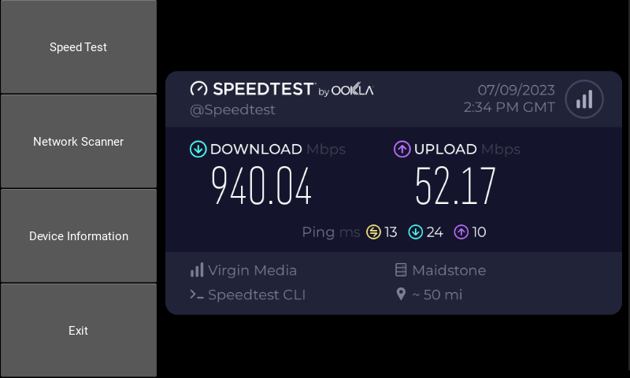

# Network Appliance
This code will run on a Raspberry Pi and an attached screen (touch or mouse). From there you can run speed tests, find devices on your network and get information about your connection to the network.

This is updated to work fully on a Raspberry Pi 4 and in testing - I use the [Pimoroni Hyperpixel 4 Touch](https://shop.pimoroni.com/products/hyperpixel-4?variant=12569485443155)

This uses the official Speedtest.net CLI tool

# Installing
You can install this as follows
```
git clone https://github.com/vwillcox/Netapp-Touch.git
cd Netapp-Touch
sudo ./install.sh
```

## Running From a remote shell
If you are running this from a remote shell, you can now use runme.sh. This will "Export" the attached display and then run the python script.

```sudo ./runme.sh```

## More information

Test your networks speed, connectivity, wifi and find what's connected. This project uses KIVY and KIVY KITCHEN code to create a
touch screen interface and QR Codes for quick information transfer to mobile devices.

It also provides information about the Raspberry-Pi's network connection (Internal IP and External IP), with a QR-CODE to quick copy
the information to a mobile device.

## More Screenshots


An example of Netapp-Touch running on a HyperPixel 4.0 Touch

Created by Vincent Willcox AKA TalkTech

# Prerequisite 
- sudo pip3 install Cython
- sudo pip3 install Kivy
- sudo pip3 install ethtool
- sudo pip3 install ipgetter2
- sudo pip3 install kivy-garden.qrcode

# Running
- python3 main.py
